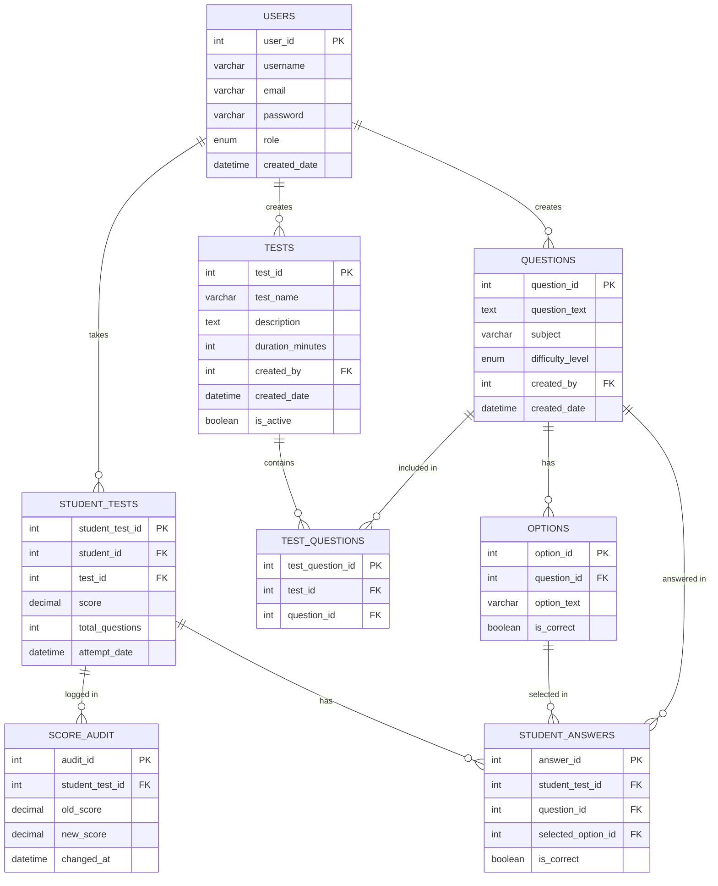

# ER Diagram — Online MCQ Test Management System

## Visual Diagram

## Relationship Summary

| Relationship | Cardinality | Description |
|---|---|---|
| USERS → QUESTIONS | 1 : Many | Admin creates multiple questions |
| USERS → TESTS | 1 : Many | Admin creates multiple tests |
| USERS → STUDENT_TESTS | 1 : Many | Student takes multiple tests |
| TESTS ↔ QUESTIONS | Many : Many | via TEST_QUESTIONS junction table |
| QUESTIONS → OPTIONS | 1 : Many | Each question has 4 options |
| STUDENT_TESTS → STUDENT_ANSWERS | 1 : Many | Each attempt has multiple answers |
| STUDENT_TESTS → SCORE_AUDIT | 1 : Many | Score changes are logged |
| OPTIONS → STUDENT_ANSWERS | 1 : Many | Option selected by students |

## Image File Location
The generated ER diagram image is saved at:
`C:\Users\Geethika\.gemini\antigravity\brain\2f524902-fec7-4329-bb6f-5361a6e83564\er_diagram_mcq_1774695618731.png`

You can open this file directly in Windows Explorer and paste it into your Word report.
